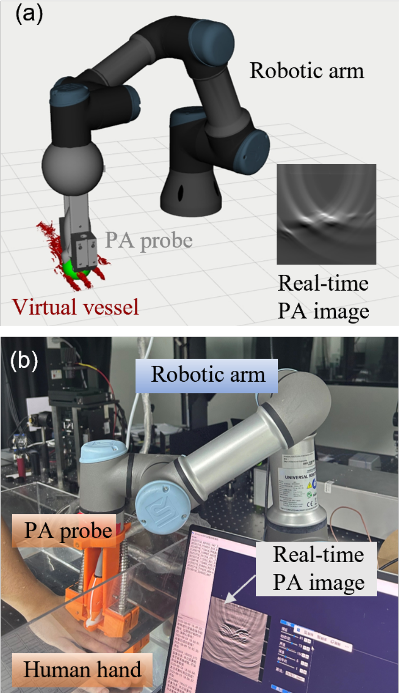
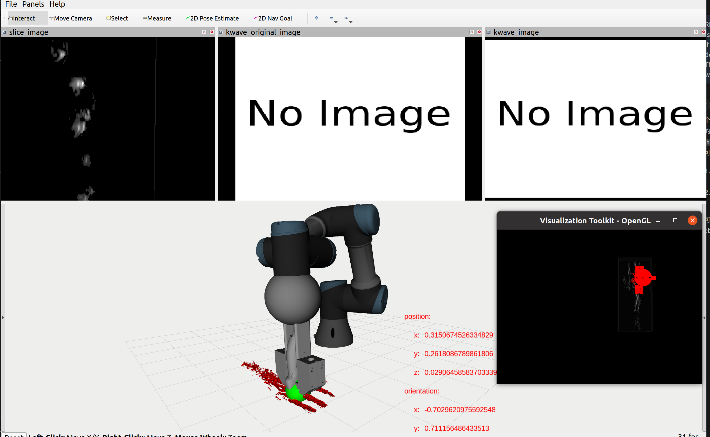
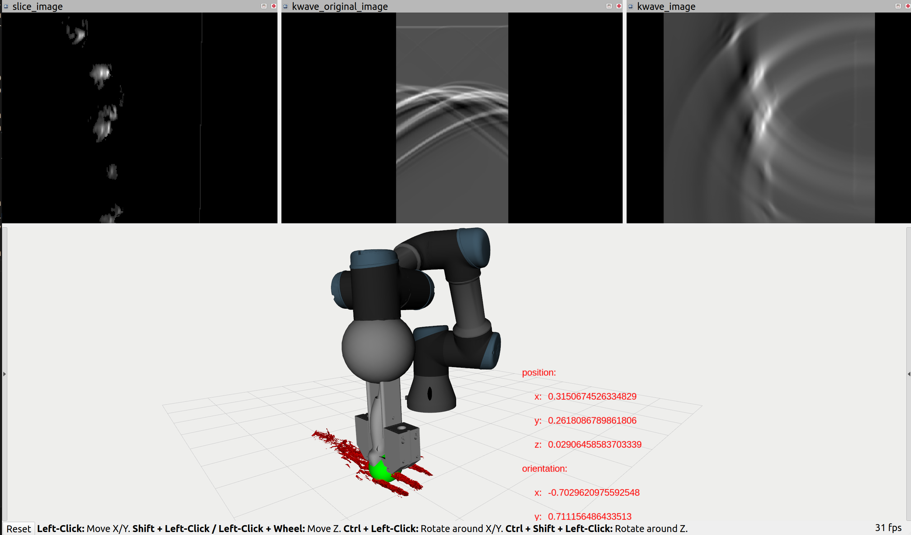
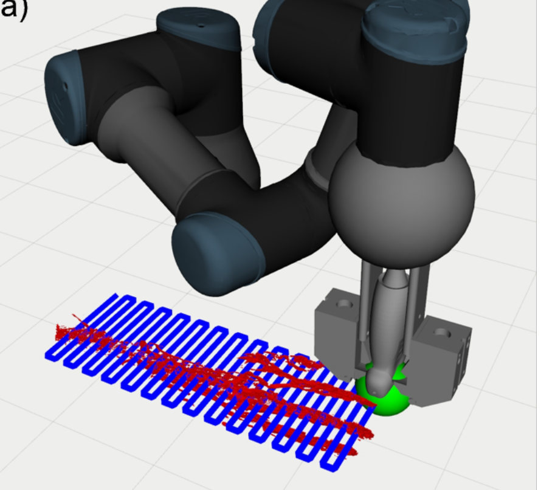

# RPAI_Sim:Robotic Photoacoustic Imaging Simulation Framework Based on ROS
Photoacoustic (PA) imaging, a hybrid modality
combining optical absorption contrast with acoustic penetration, holds significant potential for non-invasive visualization
of peripheral vessels, particularly in image-guided robotic
surgical applications. However, the development of robotic PA
imaging systems is hindered by the complexity of acoustic wave
propagation and the lack of a dedicated simulation platform.
To address this, we introduce RPAI-Sim, the first ROS-based
simulation framework tailored for robotic PA imaging, enabling
the generation of raw PA data and images under arbitrary
probe poses. RPAI-Sim integrates a 3D PA phantom, the k-Wave
toolbox, and a robot controller to simulate signal propagation,
detection, and reconstruction in 2D and 3D domains for any
pose of PA probe
[Demo Video](https://youtu.be/EEBJCAdPs5M)
<video controls src="image/video.mp4" title="Title"></video>
## This project is a photoacoustic imaging simulator based on ROS. 

To runs codes, you need to download [Anacaonda](https://www.anaconda.com/download) or [miniconda](https://www.anaconda.com/docs/getting-started/miniconda/main) first. Then you need to create **2** conda environments. And the platform are the followed:

**Ubuntu 20.04**

**ROS noetic**

**Geforce 5060Ti**

**1. create env_simulator environment**

```
conda create -name env_simulator python==3.8.20
conda activate env_simulator
cd  RPAI_Sim/PA_simulator
pip install -r requirements.txt
```

**2. create kwave environment**

To create kwave simulation environment, it is necessary to install NVIDIA drivers and the corresponding CUDA. I recommend use the **Software & Update** to install the NVIDIA drivers insted of installing from source file.

Then you can find your corresponding CUDA version on the right side. For example, CUDA 12.8 is the corresponding version for me and I need to download its source file. Follow this [tutorial](https://docs.nvidia.com/cuda/cuda-installation-guide-linux/) to install the CUDA toolkits.

With all the things installed above, we need to create the kwave environment.
```
conda create -name kwave python==3.10.18
conda activate kwave
cd RPAI_Sim/k_wave_simulation
pip install -r requirements.txt
``` 
Then you should the corresponding pytorch from [here](https://pytorch.org/). Make sure that the pytorch version you install supports your platform. And check your corresponding Torch version via [here](https://pytorch.org/get-started/previous-versions/).

**kwave-python install**

To install k-wave-python, please follow the installtion guideline from [kwave_python](https://github.com/waltsims/k-wave-python).

**3. Compiling and running**

To run the codes, it is necessary to make a catkin work place. 
```
mkdir -p ~/simulator_photoacoustic/src
mv RPAI_Sim ~/simulator_photoacoustic/src
cd ~/simulator_photoacoustic/
catkin_make
source devel/setup.bash
conda activate env_simulator
roslaunch ur3 view_ur3.launch
```
After that, the PA simulation platform can be seen. 

To run the photoacoustic simulator, open another terminal and run the following commands.

Before running codes, remember to change the vessel and linscan path. The files are available in [google driver](https://drive.google.com/drive/folders/1lewLWCkyL5CX39tKbKpFGhtOlps3p_w7?dmr=1&ec=wgc-drive-hero-goto). It is recommed to change the paths to absolute path.

```
conda activate env_simulator
roslaunch pa_simulator simulator.launch
```


After that, open another terminal and run the following commands.
```
conda activate kwave
cd k_wave_simulation/scripts
python3 kwave_ros_simulator_2d.py
```
Then you can find the following output.


**4. Automative scaning**

To implement the automative scaning, open a new terminal and run the following commands:
```
conda activate env_simulator
cd PA_simulator/scripts
python3 autocontrol.py
```
After that you can see the ur3 arm scaning automatically.

